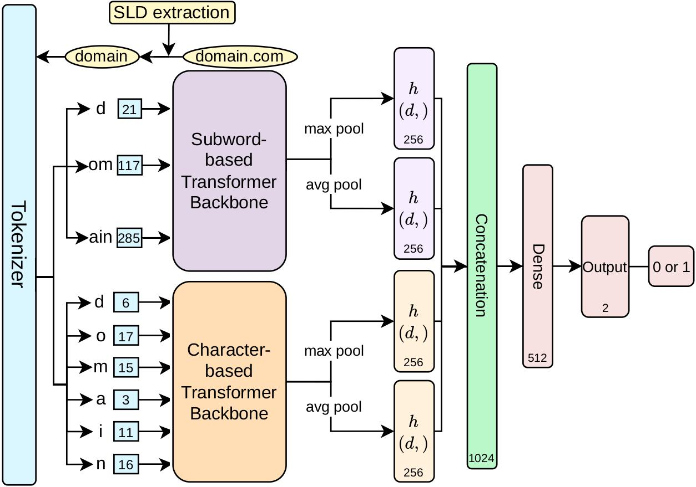

**Authors**: Chaeyoung Lee\*, **Chaeri Jung\***, Seonghoon Jeong (*Co-first authors)  
**Role**: Co-first Author (Model Implementation, SSL Pipeline Setup, etc.)  
**Lab**: SNSec Lab (Sookmyung Women's University)

## Project Summary
This project introduces **DRIFT**, a Transformer-based framework designed to tackle **Temporal Drift** in DGA detection. By combining a hybrid tokenization strategy with multi-task self-supervised learning, DRIFT learns invariant features that remain robust even as botnets evolve over time.

## Key Contributions

* **Hybrid Tokenization Strategy:** Combines character-level and subword-level encoding to capture both stochastic morphological patterns and word-based DGA structures.
* **Self-Supervised Pre-training:** Utilizes three multi-task pre-training objectives to learn contextual and structural features from unlabeled data.
* **Longitudinal Study:** Evaluated through a 9-year longitudinal study (2017-2025), demonstrating superior performance against state-of-the-art character- and word-based classifiers.

## The Problem: Temporal Drift in DGA
Most DGA (Domain Generation Algorithm) detectors perform exceptionally well on datasets they were trained on. However, in the real world, **botnets evolve.** Through our **9-year longitudinal study (2017-2025)**, we observed that even state-of-the-art models suffer from significant performance degradation as new DGA variants emerge—a phenomenon known as **Temporal Drift**.

## Our Solution: DRIFT
To mitigate this, we proposed **DRIFT** (Drift-Resilient Invariant-Feature Transformer). Instead of just memorizing current patterns, our framework focuses on learning **invariant representations** that stay robust over time.

### Core Methodology
1. **Hybrid Tokenization Strategy**: 
   DGA domains can be purely random (character-based) or dictionary-based (word-based). DRIFT uses a dual-branch encoder that processes both character-level and subword-level tokens simultaneously to capture diverse morphological structures.
   
2. **Multi-task Self-Supervised Learning (SSL)**:
   To make the model smarter without requiring labeled data, we used three pre-training tasks:
   * **Masked Token Prediction (MTP)**: Learns local dependencies by predicting hidden tokens based on the rest of the domain name.
   * **Token Position Prediction (TPP)**: Encourages the model to learn the global structure and correct ordering of tokens within a domain name.
   * **Token Order Verification (TOV)**: A sequence-level binary classification task that teaches the model to discriminate between coherent and scrambled domain names.

## Tech Stack & Methodology

* **Language:** Python
* **Library:** PyTorch, HuggingFace (transformers & tokenizers), Polars
* **Architecture:** Transformer-based Dual Branch Architecture
* **Evaluation:** Forward-chaining evaluation, Drift analysis

## Results

Our comprehensive evaluation shows that **DRIFT** significantly mitigates performance degradation over time compared to existing baselines. By learning invariant features, the model remains effective even as new DGA variants emerge.

## Quick Links

* **Code Repository:** [GitHub - snsec-net/2026-DSN-DRIFT](https://github.com/snsec-net/2026-DSN-DRIFT)
* **Dataset:** [Download Dataset via IEEE dataport](https://ieee-dataport.org/documents/longitudinal-benign-and-dga-domain-name-dataset)
* **Official Paper:** 추가 예정

---
*For more details, you can check the full paper or contact me.*